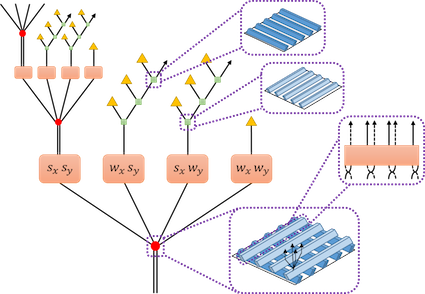

# pyfermions  [](http://arxiv.org/abs/1707.06243) [](https://arxiv.org/abs/1905.08821) [](https://arxiv.org/abs/2004.11952) [](https://pypi.python.org/pypi/pyfermions/)

A Python package for rigorous free fermionic (and bosonic) entanglement renormalization from wavelet theory.

[](notebooks/mera1d.ipynb) [](notebooks/mera2d.ipynb)

For details, please see the following three papers:

* [Rigorous free-fermion entanglement renormalization from wavelet theory](https://arxiv.org/abs/1707.06243):
    ```
    @article{latticefermions,
      title={Rigorous free-fermion entanglement renormalization from wavelet theory}
      author={Jutho Haegeman and Brian Swingle and Michael Walter and Jordan Cotler and Glen Evenbly and Volkher B. Scholz},
      journal={Phys. Rev. X},
      year={2018},
      volume={8},
      pages={011003},
      doi={10.1103/PhysRevX.8.011003},
      eprint={1707.06243},
    }
    ```

* [Quantum circuit approximations and entanglement renormalization for the Dirac field in 1+1 dimensions](https://arxiv.org/abs/1905.08821):
    ```
    @article{diracfermions,
      title={Quantum circuit approximations and entanglement renormalization for the {D}irac field in 1+1 dimensions},
      author={Freek Witteveen and Volkher Scholz and Brian Swingle and Michael Walter},
      journal={Commun. Math. Phys.},
      year={2021},
      doi={10.1007/s00220-021-04274-w},
      eprint={1905.08821},
    }
    ```

* [Bosonic entanglement renormalization circuits from wavelet theory](https://arxiv.org/abs/2004.11952):
    ```
    @article{freebosons,
      title={Bosonic entanglement renormalization circuits from wavelet theory},
      author={Freek Witteveen and Michael Walter},
      journal={SciPost Phys.},
      year={2021},
      volume={10},
      issue={6},
      pages={143},
      doi={10.21468/SciPostPhys.10.6.143},
      eprint={2004.11952},
    }
    ```

## Installation

To install the latest released version from PyPI:

```
pip install pyfermions
```

To install the bleeding-edge development version (likely unstable):

```
pip install git+git://github.com/amsqi/pyfermions
```

## Getting Started

Now download and explore some of the [Jupyter notebooks](notebooks).
The [mera1d](notebooks/mera1d.ipynb) notebook is a good starting point.

## Contributing

The contributors are listed [here](CONTRIBUTORS).

```
git clone git://github.com/amsqi/pyfermions
cd pyfermions
pip install -e .[dev]
```
